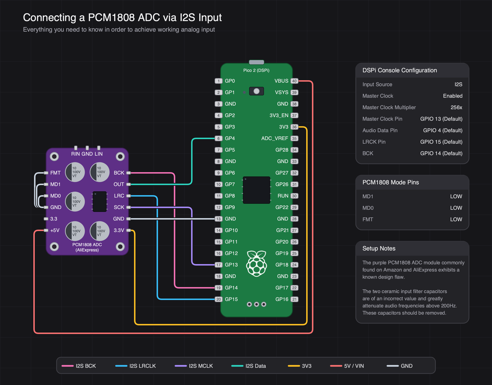
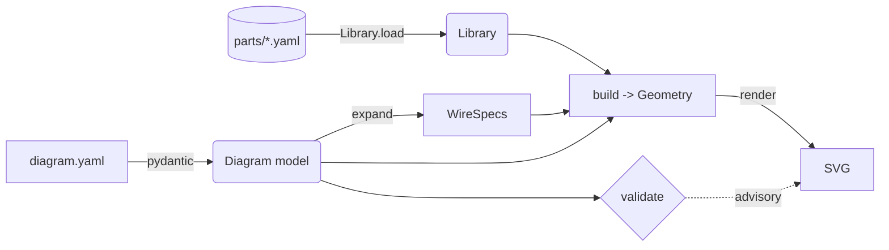

# wiregen

**Declarative generator for beautiful, modern wiring diagrams.**

You describe **parts** (from a library of ICs and boards) and **pin-to-pin
wiring** in a small YAML file; wiregen owns every pixel and produces a clean,
themeable SVG. No SVG bookkeeping, no manual coordinates, no guesswork. It
understands signal standards (I2S, S/PDIF, I2C, SPI, …) so wires are
colour-coded and a whole bus collapses into a one-line shorthand.

The goal is to show **how things connect** — like a breadboard wiring guide —
not to design or electrically validate circuits.



---

## Table of contents

- [Why wiregen](#why-wiregen)
- [Quick start](#quick-start)
- [How it works](#how-it-works)
- [Authoring a diagram](#authoring-a-diagram)
  - [Top-level fields](#top-level-fields)
  - [Parts](#parts)
  - [Connections](#connections)
  - [Annotations](#annotations)
- [The command line](#the-command-line)
- [The part library](#the-part-library)
  - [A part definition](#a-part-definition)
  - [Pins](#pins)
  - [Decorations](#decorations)
  - [Adding your own part](#adding-your-own-part)
- [Signal standards & wire colours](#signal-standards--wire-colours)
- [Themes](#themes)
- [Python API](#python-api)
- [Repository map](#repository-map)
- [Codebase walk-through](#codebase-walk-through)
- [Testing](#testing)
- [Design philosophy & non-goals](#design-philosophy--non-goals)
- [Credits & licence](#credits--licence)

---

## Why wiregen

Hand-drawing wiring diagrams in a vector editor is slow and fragile: move one
part and every wire breaks. Fritzing-style tools are great but heavyweight.
wiregen takes the opposite approach — **you state intent, the engine owns
layout**:

- **Declarative.** One readable YAML file per diagram. Diff-able, reviewable,
  generatable by an LLM.
- **No coordinates, ever.** You say a part goes in the `left` region; the
  engine decides exact positions, channels, and wire routing.
- **Bus-aware.** `bus: i2s` expands into BCK/LRCLK/MCLK/Data wires, each
  coloured by its role, with a matching legend.
- **Forgiving pin lookup.** Reference a pin by name, display label, or net;
  typos get "did you mean…" suggestions.
- **Themeable.** Four built-in colour schemes; palettes adapt so ground/power
  stay legible on any background.
- **A checklist for free.** `--table` prints a from→to wiring list generated
  from the same model, so it never drifts from the picture.

---

## Quick start

Requires **Python ≥ 3.10**.

```bash
# 1. clone and enter
git clone https://github.com/WeebLabs/wiregen.git
cd wiregen

# 2. install into a virtualenv (editable, with dev + PNG extras)
python3 -m venv .venv && . .venv/bin/activate
pip install -e ".[dev,png]"

# 3. render the bundled example
wiregen render examples/pcm1808_to_dspi.yaml -o out.svg --table
```

That writes `out.svg` and prints a connection checklist. Try a different look:

```bash
wiregen render examples/pcm1808_to_dspi.yaml --theme light --grid -o light.svg
```

The `[png]` extra pulls in [cairosvg](https://cairosvg.org) if you want PNGs:

```python
import cairosvg
cairosvg.svg2png(url="out.svg", write_to="out.png", scale=2.0)
```

---

## How it works

A render is a short, one-way pipeline. Each stage has a single job and a clean
data type between it and the next:



1. **Parse.** `diagram.yaml` is validated into a typed [`Diagram`](wiregen/model.py)
   (pydantic, `extra="forbid"` — unknown keys are errors).
2. **Load the library.** Every `wiregen/parts/*.yaml` becomes a `PartDef`.
3. **Validate.** Advisory wiring-sanity checks (unknown part/pin, unconnected
   part…). Errors block rendering; warnings don't.
4. **Expand connections.** Explicit wires and bus shorthands flatten into one
   list of `WireSpec` endpoints — the single source of truth for "what wires
   exist," shared by the validator, the layout engine, and the table writer.
5. **Build geometry.** [`layout.build`](wiregen/layout.py) turns regions/order
   hints into real boxes, pin positions, routed wires, cards, and canvas
   bounds — a pure `Geometry` object with no SVG in it.
6. **Render.** [`render`](wiregen/render.py) serialises that `Geometry` to SVG
   for the chosen `Theme`.

Because layout and rendering are separate, the engine can reason about
positions without touching strings, and the renderer never makes layout
decisions.

---

## Authoring a diagram

A diagram is one YAML document. Here is the bundled example, trimmed:

```yaml
title: Connecting a PCM1808 ADC via I2S Input
subtitle: Everything you need to know in order to achieve working analog input
grid: true

parts:
  adc:
    part: pcm1808_board     # an id from the part library
    region: left
    label: PCM1808 ADC (AliExpress)
    offset_x: 48            # fine nudges in px, if you need them
    offset_y: 24
  pico:
    part: pico2
    region: right
    label: Pico 2 (DSPi)

connections:
  # one shorthand expands into four role-coloured I2S wires
  - bus: i2s
    from: pico
    to: adc
    map:
      GP14: BCK
      GP15: LRC
      GP13: SCK
      GP4: OUT
  # explicit wires; `route: bottom` detours under the parts
  - { from: pico.3V3, to: adc.3V3, route: bottom }
  - { from: pico.VBUS, to: adc.5V, route: bottom }
  - { from: pico.GND, to: adc.GND }

annotations:
  - card: PCM1808 Mode Pins
    rows: { MD1: LOW, MD0: LOW, FMT: LOW }
  - card: Setup Notes
    text: >-
      The purple PCM1808 ADC module commonly found on Amazon and AliExpress
      exhibits a known design flaw.

      The two ceramic input filter capacitors are of an incorrect value …
```

### Top-level fields

| Field | Type | Meaning |
|---|---|---|
| `title` | string | Big heading (optional). |
| `subtitle` | string | Sub-heading under the title (optional). |
| `theme` | string | Colour scheme; overridden by `--theme`. Default `neutral-dark`. |
| `grid` | bool | Draw a faint background grid. Default `false`; `--grid` forces it on. |
| `parts` | map | Placed part instances, keyed by an id **you** choose. |
| `connections` | list | The wires (see below). |
| `annotations` | list | Floating info cards. |

### Parts

Each entry under `parts` is a `PartInstance`. The key (`adc`, `pico`) is the
instance id you reference in connections.

| Field | Default | Meaning |
|---|---|---|
| `part` | — | Part id from the library (`wiregen list-parts`). |
| `label` | part's name | Overrides the on-board display name. |
| `region` | `center` | Coarse column hint: `left`, `center`, `right`. |
| `order` | — | Vertical order within a region. |
| `flip` | `false` | Mirror left↔right pins so a header faces the channel. |
| `offset_x` / `offset_y` | `0` | Manual nudge in px (+x right, +y down). |

You never give coordinates — only which column a part lives in and (optionally)
its order within that column. The engine centres each column and lays out the
rest.

### Connections

A connection is **either** an explicit pin-to-pin wire **or** a bus shorthand.

**Explicit:**

```yaml
- { from: pico.GP14, to: adc.BCK, label: "clock", color: "#ff0000" }
```

`from`/`to` are `instance.pin` tokens. A pin is resolved by **name → display
label → net** (so `pico.GND` matches any GND pad; the nearest one to the other
end is chosen).

**Bus shorthand** — expands into one wire per `map` entry, each coloured by its
role:

```yaml
- bus: i2s
  from: pico            # just the instance ids here
  to: adc
  map: { GP14: BCK, GP15: LRC, GP13: SCK, GP4: OUT }
```

Shared optional fields on either form:

| Field | Meaning |
|---|---|
| `label` | Text label for the wire. |
| `color` | Explicit hex override (otherwise derived from signal/net). |
| `signal` | Force a bus family for colouring. |
| `route` | `top` or `bottom` — detour a wrapping wire above/below the parts. |

### Annotations

Floating cards placed in a far-right column.

```yaml
- card: DSPi Console Configuration   # title
  rows:                              # key/value table
    Input Source: I2S
    Master Clock: Enabled
- card: Setup Notes
  text: >-                           # free paragraph(s); blank line = new para
    First paragraph …

    Second paragraph …
```

`rows` renders as an aligned key/value table; `text` is word-wrapped to the
card width, with blank lines in the source starting new paragraphs. `anchor`
(an instance id) and `region` are optional placement hints.

---

## The command line

```text
wiregen render <diagram.yaml> [-o out.svg] [--theme NAME] [--grid] [--table]
wiregen validate <diagram.yaml>
wiregen list-parts
wiregen describe-part <id>
wiregen list-themes
wiregen list-buses
```

| Command | What it does |
|---|---|
| `render` | Validate, then write SVG. `--table` also prints the wiring checklist; `--grid` adds the background grid; `--theme` overrides the diagram's theme. Defaults output to `<diagram>.svg`. |
| `validate` | Run the sanity checks and print issues. Exit non-zero on errors. |
| `list-parts` | Every part id, name, package, and pin count. |
| `describe-part` | A part's pins — names, sides, signals, nets, numbers. |
| `list-themes` | Available colour schemes. |
| `list-buses` | Known signal standards and their role→colour map. |

The `list-*` / `describe-part` commands exist so a person **or an LLM** can
ground themselves in the real library before authoring a diagram.

---

## The part library

Parts are reusable components defined once in `wiregen/parts/*.yaml` and
referenced by id. Bundled parts:

| id | What |
|---|---|
| `pico2` | Raspberry Pi Pico 2 (RP2350), 40-pin board. |
| `pcm1808` | PCM1808 stereo ADC, bare 14-pin TSSOP IC. |
| `pcm1808_board` | The common purple PCM1808 breakout board. |

### A part definition

A `PartDef` is a body plus an ordered list of pins. **No pixel coordinates
appear** — only which physical side each pin is on.

| Field | Meaning |
|---|---|
| `id` | Unique id used in diagrams. |
| `name` | Human name (default label). |
| `package` | `board`, `module`, `ic`, `header`, `component`. |
| `style` | Render hint: `pcb`, `chip`, `card`. |
| `color` | Substrate colour (e.g. the green Pico PCB, the purple breakout). |
| `connector` | Top-edge connector hint, e.g. `usb`. |
| `description` | Free text shown by `describe-part`. |
| `pins` | Ordered list of pins. |
| `decorations` | Cosmetic on-board components (see below). |
| `width` / `height` | Optional body-size overrides in px. |

### Pins

| Field | Meaning |
|---|---|
| `name` | Pin name (used for lookup). |
| `side` | Physical side: `left`, `right`, `top`, `bottom`. |
| `signal` | Bus/standard family: `i2s`, `i2c`, `power`, `analog`, … |
| `role` | Role within the family: `bck`, `lrck`, `mck`, `data`, … |
| `dir` | `in`, `out`, `bidir`, `power`, `passive`. |
| `net` | Electrical net tag for grouping/colour: `gnd`, `3v3`, `5v`, … |
| `label` | Display text (defaults to `name`). |
| `number` | Physical pin number / silk designator (printed on the pad). |

Pins are placed by their order within each side and a fixed pitch — a taller
body just gains margin. Numbered side pins render on enlarged pads with the
number printed on the copper, so a routed wire can never obscure it.

### Decorations

Purely cosmetic shapes drawn on a board for visual likeness. `at` is a
normalised `[x, y]` in `0..1`, so decorations scale with the body.

| `type` | Drawn as | Uses |
|---|---|---|
| `cap` | Electrolytic can with a polarity mark | `r`, `label` |
| `resistor` | SMD chip resistor | `w`, `h` |
| `ic` | Black chip with legs and a pin-1 dot | `w`, `h`, `label` |
| `dot` | Small filled dot (LED, via) | `r` |
| `hole` | Plated mounting hole | `r` |
| `button` | SMD tactile button (e.g. BOOTSEL) | `w`, `h`, `label` |
| `logo` | The Raspberry Pi mark, in silkscreen | `r` |

All accept `rot` (degrees about the centre). The Pico's RP2350, BOOTSEL button,
status LED, debug header, and Pi logo are all just decorations — see
[`wiregen/parts/pico2.yaml`](wiregen/parts/pico2.yaml).

### Adding your own part

1. Drop a new `your_part.yaml` in `wiregen/parts/` following the schema above.
2. `wiregen list-parts` should show it; `wiregen describe-part your_part`
   confirms the pins.
3. Reference it from a diagram via `part: your_part`.

You can also keep parts outside the repo and load them with
`Library.load(extra_dirs=[Path("my_parts")])` from the Python API.

---

## Signal standards & wire colours

[`wiregen/standards.py`](wiregen/standards.py) is the registry of buses. Each
bus has a fallback colour and an optional role→hue map. `list-buses` prints
them. Built in: **i2s, spdif, i2c, spi, uart, pdm, gpio, analog, power**. I2S
splits into per-role hues (BCK / LRCLK / MCLK / Data).

A wire's colour is resolved by priority — the first rule that matches wins:

1. **Explicit** `color:` on the connection.
2. **Net** colour (`theme.nets`): ground and power use the insulation colour a
   builder actually reaches for (e.g. ground light on dark themes).
3. **Per-role hue** (`theme.hues`) — e.g. I2S BCK vs LRCLK.
4. **Per-bus hue**, then the bus's fallback colour.
5. The theme's **default wire** colour.

The legend at the bottom is assembled automatically from whatever nets and
buses actually appear.

---

## Themes

A [`Theme`](wiregen/theme.py) is the single source of the look: canvas, bodies,
pads, wires, cards, grid, plus the wire/net/hue palette. Pick one with the
diagram's `theme:` field or `--theme`; default is `neutral-dark`.

| Theme | Background | Notes |
|---|---|---|
| `neutral-dark` | `#161619` | Default. |
| `carbon` | `#0a0a0a` | Near-black. |
| `midnight` | `#0b1120` | Blue-grey. |
| `light` | `#fbfcfe` | Light paper; palettes flip dark. |

Rendered variants of the example are committed for reference:
[neutral-dark](examples/theme_neutral-dark.svg) ·
[carbon](examples/theme_carbon.svg) ·
[midnight](examples/theme_midnight.svg) ·
[light](examples/theme_light.svg).

Add a scheme by appending a `Theme` (usually via `dataclasses.replace` of an
existing one) to `THEMES` in `wiregen/theme.py`.

---

## Python API

The package is usable as a library; `wiregen/__init__.py` exposes the
convenience surface:

```python
from wiregen import load_diagram, render_diagram

diagram = load_diagram("examples/pcm1808_to_dspi.yaml")
svg = render_diagram(diagram, theme="midnight")   # str of SVG
open("out.svg", "w").write(svg)
```

Lower-level pieces if you need them:

```python
from wiregen import Library, build, render, validate, get_theme

lib = Library.load()                       # or Library.load(extra_dirs=[...])
issues = validate(diagram, lib)            # list[Issue]
geo = build(diagram, lib, get_theme("carbon"))   # Geometry (no SVG)
svg = render(geo, get_theme("carbon"), grid=True)
```

---

## Repository map

```text
wiregen/
├── pyproject.toml          # packaging, deps, the `wiregen` console script
├── README.md
├── docs/                   # preview images for this README
├── examples/
│   ├── pcm1808_to_dspi.yaml    # the worked example
│   └── *.svg                   # committed renders (one per theme)
├── tests/
│   └── test_smoke.py       # end-to-end + invariant checks
└── wiregen/
    ├── __init__.py         # public API: load_diagram / render_diagram / …
    ├── __main__.py         # `python -m wiregen`
    ├── cli.py              # argparse front end (render/validate/list-*)
    ├── model.py            # pydantic schema: Diagram, PartDef, Pin, …
    ├── library.py          # loads parts/*.yaml; forgiving pin resolution
    ├── standards.py        # bus registry + wire-colour resolution
    ├── connections.py      # expands connections -> flat WireSpec list
    ├── validate.py         # advisory wiring-sanity checks
    ├── layout.py           # intent -> Geometry (all coordinates live here)
    ├── render.py           # Geometry -> SVG
    ├── theme.py            # colour schemes + palettes
    ├── table.py            # from->to checklist (text / markdown)
    ├── assets/             # vendored Raspberry Pi logo path
    └── parts/              # the part library (one YAML per component)
```

## Codebase walk-through

The data flows in one direction; read the modules in this order to follow it.

| Module | Responsibility | Key types / entry points |
|---|---|---|
| [`model.py`](wiregen/model.py) | The declarative schema and the only surface a user authors. Strict pydantic models. | `Diagram`, `PartInstance`, `Connection`, `Annotation`, `PartDef`, `PinDef`, `Decoration` |
| [`library.py`](wiregen/library.py) | Loads `parts/*.yaml` into `PartDef`s; resolves a pin token to candidate pins (name → label → net) with fuzzy suggestions. | `Library.load`, `Library.candidates`, `Library.suggest` |
| [`standards.py`](wiregen/standards.py) | Knows buses and how to colour a wire from signal/role/net against a theme. | `STANDARDS`, `wire_color`, `wire_hue`, `get_bus` |
| [`connections.py`](wiregen/connections.py) | Flattens explicit wires and bus shorthands into one `WireSpec` list — the shared truth for validate/layout/table. | `expand`, `WireSpec`, `Endpoint` |
| [`validate.py`](wiregen/validate.py) | Advisory checks: parts resolve, pins exist, parts are connected, anchors are real. Errors block render. | `validate`, `Issue` |
| [`layout.py`](wiregen/layout.py) | The heart: turns region/order hints into boxes, pin coordinates, and routed wires (jumper / wrap / channel), packs elbow tracks, places cards, computes bounds. Owns **all** geometry. | `build`, `Geometry`, `Box`, `wrap_card_text` |
| [`render.py`](wiregen/render.py) | Serialises a `Geometry` to SVG: PCB/chip/card bodies, decorations, numbered pads, casing-backed wires, cards, legend, optional grid. | `render` |
| [`theme.py`](wiregen/theme.py) | Visual tokens and the theme registry; per-theme net/hue palettes. | `Theme`, `THEMES`, `get_theme` |
| [`table.py`](wiregen/table.py) | The from→to wiring checklist, in plain text or Markdown. | `as_text`, `as_markdown`, `build_rows` |
| [`cli.py`](wiregen/cli.py) | Wires the above into subcommands. | `main` |

A few details worth knowing:

- **Layout never emits strings; render never decides positions.** The
  `Geometry` boundary keeps the two honest and testable.
- **Wires are classified** in `layout.py` as `jumper` (same edge of one part),
  `wrap` (a detour above/below, e.g. power rails via `route:`), or `channel`
  (through the gap between columns). Channel wires share "elbow tracks" when
  their vertical spans don't overlap, so the routing stays compact.
- **Pin numbers live on the pads.** Numbered side pins draw an enlarged pad
  with the number on it, so wires can't obscure it.
- **Card text wraps** to the card width (`wrap_card_text`), and both the layout
  height and the renderer use the same wrap, so they never disagree.

---

## Testing

```bash
pip install -e ".[dev]"
pytest -q
```

[`tests/test_smoke.py`](tests/test_smoke.py) loads the bundled example and
checks the library loads, the example validates clean, it renders to a complete
SVG, the I2S bus expands to the right number of wires, the connection table has
the expected pairs, every theme renders and adapts its palette, and unknown
themes/pins error as intended.

---

## Design philosophy & non-goals

- **Intent in, pixels out.** Authors describe *what connects*; the engine owns
  *where things go*. This is what makes diagrams robust to edits and friendly
  to generate.
- **Legibility over realism.** Decorations and colours exist to make a diagram
  recognisable and clear, not to be a faithful schematic.
- **Forgiving, self-correcting input.** Fuzzy pin/part lookup and advisory
  validation are tuned so a human or an LLM can iterate quickly.
- **Not an EDA tool.** wiregen does **not** check electrical correctness, net
  connectivity rules, current, or pin compatibility. It draws the wiring you
  describe. Treat it as a wiring *guide*, not a design rule checker.

---

## Credits & licence

- The Raspberry Pi logo path in `wiregen/assets/` is from
  [Font Awesome Free](https://fontawesome.com) 6.5.2, used under
  **CC BY 4.0** (Icons), © Fonticons, Inc.
- "Raspberry Pi" and the Pi logo are trademarks of Raspberry Pi Ltd; the part
  drawings here are simplified likenesses for illustration only.

No project licence is declared yet — add one (e.g. `LICENSE`) before relying on
this in other work.
